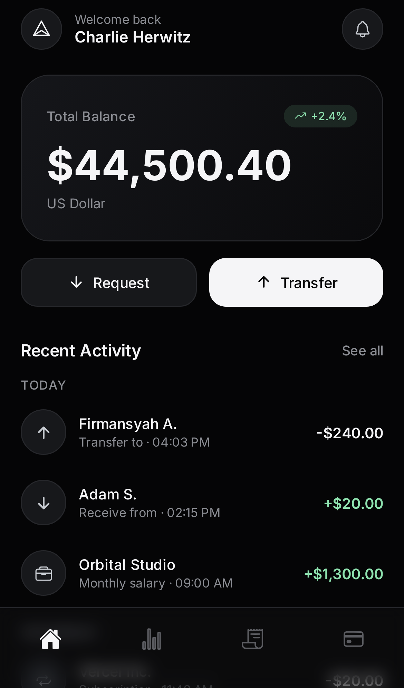
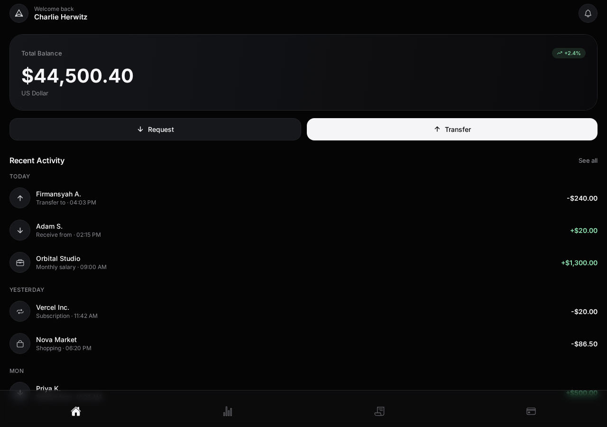
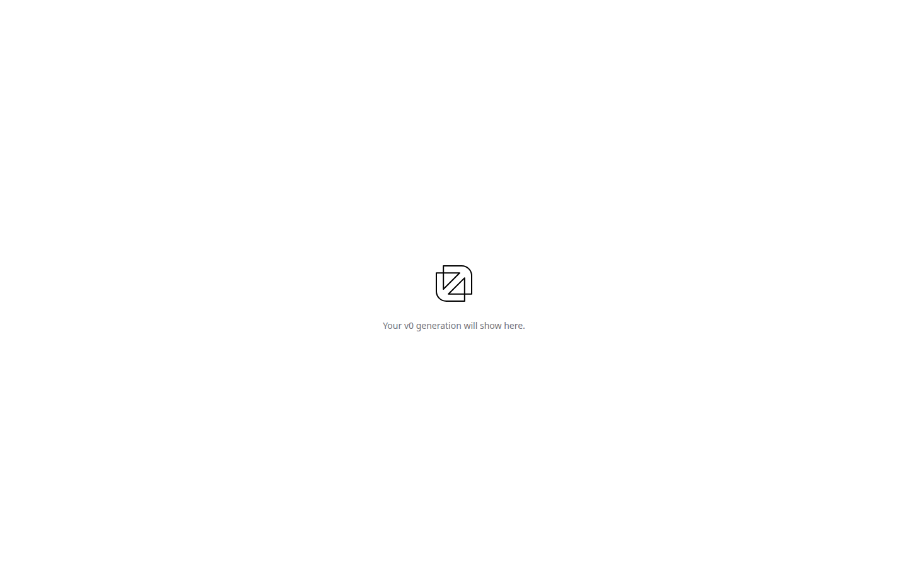

# MSTRMND

Dual-stack monorepo for the MSTRMND app.

| Stack | Path | What it is |
|--------|------|------------|
| **Expo (React Native)** | `mobile/` | The product UI (onboarding, tabs, transfer/request) |
| **Next.js** | `web/` | The web shell |

## Previews

### Mobile (Expo) — onboarding


### Mobile (Expo) — home



### Desktop (Expo Web)



### Desktop (Next.js)



## Run Expo (mobile)

```bash
cd mobile
npm install
npx expo start
```

Then:

- press `i` / `a` for iOS / Android simulator, or
- scan the QR code with **Expo Go**, or
- press `w` for web (`http://localhost:8081`)

Web-only shortcut:

```bash
cd mobile
npx expo start --web
```

## Run Next.js (web)

```bash
cd web
npm install
npm run dev
```

Open `http://localhost:3000`.

## Notes

- Mobile data is mock (`mobile/lib/mock-data.ts`).
- Expo web needs `react-native-web` (already in `mobile/package.json`).
- NativeWind dark mode is set to `class` so Expo web does not throw color-scheme errors.
